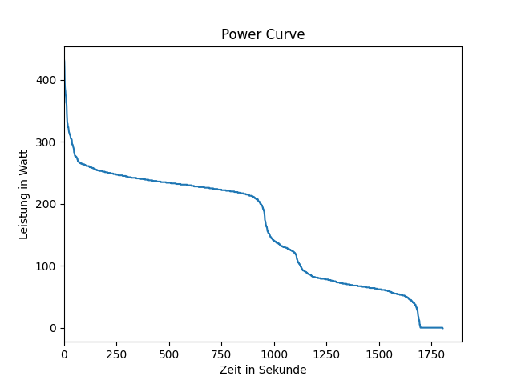

# Programmieruebung-2

## Franka Kaiser, Olivia Kiechl 

## Installation pdm 

# Zuerst wurde pdm mittels dem Befehl pdm install in dem Terminal installiert. Bei diesem Schritt müssen mehrere Dinge ausgefüllt werden, wie zb. Benutzername, Email, Python Version. Im nächsten Schritt wurde mittels pdm add numpy und pdm add matplotlib diese beiden Bibliotheken hinzugefügt. 

# In unserer Datei "sort.py" wurde als erstes der Bubblesort erstellt. Dort gibt es eine Funktion Names "bubble_sort" welche die Daten von dem Code aus der "load_data.py" verwendet. In unserer Datei Namens "powercurve.py" wurden als erstes mit dem Befehl "import" die verschiedenen Daten aus unseren codes geladen und quasi in diesem Code hinzugefügt, sodass de Code auf die anderen zurückgreifen kann. Hier ist es auch wichtig die Module "numpy" und "matplotlib" zu importieren, damit wir unsere Grafik darstellen können. In dem Code "powercurve.py" wurde unsere Grafik geplotet, also bildlich dargstellt. Mit plt.xlable/plt.ylable haben wir unsere Achsen auf der Grafik noch beschriftet. Mittels plt.show() haben wir unser Bild dann ausgegeben. 

# Unsere Grafik: 

